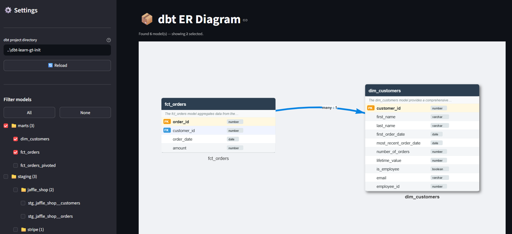

# dbt-erd

An interactive Entity Relationship Diagram viewer for [dbt](https://www.getdbt.com/) projects.

Point it at any dbt project directory and it reads your YAML schema files to render a live, draggable ER diagram — complete with column types, primary/foreign keys, and relationship arrows.



---

## Features

- **Auto-discovery** — recursively scans the `models/` directory for `*.yml` schema files
- **dbt v1.6+ compatible** — supports both `tests:` and `data_tests:` key syntax, and nested `arguments:` in `relationships` config
- **Rich table cards** — each model rendered as a styled card showing columns, data types, and PK 🟠 / FK 🔵 badges
- **Interactive diagram** — drag nodes freely, zoom, pan; arrows are frozen in place after layout
- **Relationship edges** — FK edges labelled with inferred cardinality (`1 : 1` or `many : 1`)

---

## Installation

```bash
git clone https://github.com/RyanCotsakis/dbt-erd.git
cd dbt-erd
pip install -r requirements.txt
```

**Requirements:** Python 3.10+

---

## Usage

```bash
streamlit run app.py
```

Then open [http://localhost:8501](http://localhost:8501) in your browser.

Enter the path to your dbt project in the sidebar (defaults to the current working directory) and press **Enter** or click **Reload**.

---

## How it works

### Parsing

`parser.py` walks `<project>/models/**/*.yml` and extracts:

| What | How detected |
|---|---|
| Primary key | Column has both `unique` + `not_null` tests, **or** description contains "primary key" |
| Foreign key | Column has a `relationships` test with `to: ref(...)` and `field:` |
| Relation type | FK column also has `unique` → `1 : 1`; otherwise → `many : 1` |

### Layout

`renderer.py` computes a topological layout from the FK graph before passing nodes to [vis.js](https://visjs.github.io/vis-network/docs/network/):

- Models with FK columns (consumers / fact tables) → leftmost columns
- Referenced models (dimensions / staging) → rightmost columns
- Within each column, nodes are stacked using their exact pixel heights — no overlaps

### Visualization

Each model is rendered as an SVG image node in vis.js — no physics engine, no spring-back.

---

## Privacy

This tool runs entirely on your local machine — no data is sent to external servers:

- **vis.js** is bundled locally (`vis-network.min.js`) — no CDN requests
- **Streamlit** is bound to `localhost` only and telemetry is disabled (`.streamlit/config.toml`)

> **Note:** Streamlit's UI loads fonts from `fonts.googleapis.com`. This can be blocked at the OS/firewall level if needed (e.g. `/etc/hosts` entry).

---

## Project structure

```
dbt-erd/
├── app.py                    # Streamlit UI
├── parser.py                 # dbt YAML → Model dataclasses
├── renderer.py               # Model dataclasses → standalone vis.js HTML
├── vis-network.min.js        # Bundled vis.js (no CDN)
├── .streamlit/
│   └── config.toml           # Binds to localhost; disables telemetry
├── screenshot.png
└── requirements.txt
```

---

## License

MIT
